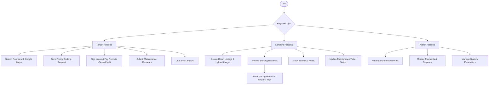

# Smart Room Renting System – Product Requirements Document (PRD)

---

## 1. Document Control & Metadata

- **Project Title:** Smart Room Renting System – A Mobile-Based Tenant Management Application
- **Target Region:** Nepal ( Kathmandu, Lalitpur, Pokhara, Bhaktapur )
- **Frontend Stack:** Flutter (Dart) for Android & iOS
- **Backend Stack:** Django REST Framework (Python)
- **Database Engine:** PostgreSQL (Production) / SQLite (Local Dev)
- **Push Notifications:** Firebase Cloud Messaging (FCM)
- **Payment Gateways:** eSewa & Khalti (Local Integrations)
- **Location Services:** Google Maps API

---

## 2. Executive Summary & Introduction

The **Smart Room Renting System** is an end-to-end, mobile-first marketplace and management application designed to digitize the entire life cycle of rental housing in Nepal. Currently, urban centers like Kathmandu are seeing high migration rates for education and employment, resulting in a complex, unorganized rental market.

While basic property listing sites exist, they operate solely as advertising boards and abandon users after the initial contact. This system bridges that gap by digitizing post-lease workflows, linking discovery directly to role-based tenant profile validation, digital rental agreements, automated rent ledger tracking, secure local payments (eSewa/Khalti), maintenance ticket management, and encrypted landlord-tenant chat.

---

## 3. Problem Statement & Objectives

### 3.1 Problem Statement
The traditional rental ecosystem in Nepal is plagued by structural inefficiencies:
1. **Lack of Centralized Mobile Platform:** Landlords rely on generic social media groups (e.g., "Flat Finder Kathmandu") or physical brokers, leading to unstructured, unreliable listings.
2. **Manual Rent Collection & Ledger Tracking:** Rent tracking relies on hand-written receipts or personal memory. Tenants have no proof of payment, and landlords struggle with tracking balances, arrear accounts, and security deposits.
3. **No Legal Protections:** Written rental agreements are rarely signed or maintained. In the event of rent defaults or property damage, both parties face severe legal ambiguities.
4. **Ad-Hoc Communication & Untracked Maintenance:** Repair requests are made via casual phone calls or text messages, resulting in slow resolutions, forgotten tickets, and disputes.

### 3.2 Objectives of the Proposed System
- **Develop a Single Mobile Interface:** Provide an integrated Flutter application that serves both landlords and tenants.
- **Provide Verification & Trust:** Incorporate formal profile management and role-based actions.
- **Automate Financial Ledgers:** Track rent due dates, calculate security deposits, manage maintenance fees, and generate payment receipts.
- **Establish Digital Agreements:** Standardize dynamically populated lease agreements with binary signature capture.
- **Implement Nepali Payment Gateways:** Integrate eSewa and Khalti APIs directly into the booking ledger.
- **Establish a Maintenance Workflow:** Support photo uploads and structured tracking for repairs.

---

## 4. User Personas & User Journeys



### 4.1 Tenant Journey
1. **Onboarding:** Registers, selects the `tenant` role, enters location details (province, district, ward), and logs in to get a JWT token.
2. **Discovery:** Opens map screen, searches by price range, furnished status, parking, or gender preferences.
3. **Booking:** Submits a booking request for a preferred room, adding preferred move-in dates.
4. **Contract & Onboarding:** Once approved, receives a notification, reviews the digital agreement, signs it, and pays the security deposit/first month's rent via Khalti/eSewa.
5. **Living Experience:** Submits a maintenance request for a broken pipe with a photo, tracks repair status, and messages the landlord directly.

### 4.2 Landlord Journey
1. **Profile Setup:** Registers, sets role to `landlord`, and uploads proof of property ownership (Lalpurja).
2. **Listing creation:** Lists a new room, specifies monthly rent, security deposit, maintenance charges, ward number, and uploads room photos.
3. **Booking Approval:** Receives real-time notification of a booking request, reviews the tenant profile, and clicks `Approve`.
4. **Contract Execution:** Generates the contract terms, signs the agreement, and waits for tenant signature and payment.
5. **Management:** Tracks monthly income dashboard and assigns maintenance repair tickets to technicians.

---

## 5. Functional Requirements

### Module A: Secure User Authentication
- **UUID-based Custom User Model:** Eliminates sequential ID enumeration vulnerabilities.
- **Authentication Protocol:** Secure JWT token pair exchange (15-min access tokens; 7-day rotating refresh tokens).
- **OTP Verification Flow:** Prevents fake signups by sending verification codes via email and tracking expiry states.
- **Role-Based Access Control (RBAC):** Django middleware validates roles before allowing CRUD operations on rooms, agreements, or payments.

### Module B: Room Listing & Discovery
- **Property Upload Wizard:** Landlords define structured specs (furnishing, WiFi, AC, parking, food, ward, area, and gender preference).
- **Multi-Image Attachments:** Room models support a one-to-many relationship with image models.
- **Interactive Search Engine:** Filterable search and listing capabilities using location parameters.

### Module C: Booking Workflow
- State machine with four statuses: `Pending` ➡️ `Approved` / `Rejected` ➡️ `Cancelled`.
- Automatic room isolation: Once a booking is marked `Approved`, the room's `is_available` flag dynamically flips to `False`.

### Module D: Lease Agreement Management
- Dynamic populator merges data (Tenant Name, Landlord Name, Room Price, Ward Number) into a legal template.
- Signature tracking maintains Boolean signature status and signs dates.

### Module E: Payment Tracking
- API hooks for eSewa and Khalti gateway callbacks.
- System processes transactions and transitions states (`Pending` ➡️ `Verified` or `Failed`).

### Module F: Maintenance Requests
- Tenants submit structured tickets (photo, description).
- Landlords manage status (`Pending` ➡️ `In Progress` ➡️ `Resolved`).

### Module G: In-app Messaging & Notifications
- Instant text communication tied to booking identifiers.
- Push alerts triggered via Firebase Cloud Messaging for payment dues, booking approvals, and chats.

---

## 6. System Architecture & Tech Justification

```
+-----------------------------------+
|          Client Layer             |
|   +---------------------------+   |
|   |    Flutter Mobile App     |   |
|   | (Android / iOS UI Engine) |   |
|   +---------------------------+   |
+-----------------+-----------------+
                  | (HTTPS Requests / JWT Auth)
                  v
+-----------------+-----------------+
|          Backend Layer            |
|   +---------------------------+   |
|   |  Django REST Framework    |   |
|   |  - Custom User Auth       |   |
|   |  - REST Controllers/Views |   |
|   |  - Parametric SQL queries |   |
|   +---------------------------+   |
+-----------------+-----------------+
                  | (PostgreSQL Driver)
                  v
+-----------------+-----------------+
|          Database Layer           |
|   +---------------------------+   |
|   |      PostgreSQL / SQLite  |   |
|   | (Structured 3NF Relations)|   |
|   +---------------------------+   |
+-----------------------------------+
```

- **Flutter:** Single-codebase cross-platform system compiling to fast, native machine code via Impeller/Skia engines, eliminating WebView bottlenecks for interactive Google Maps rendering.
- **Django REST Framework:** Provides automated ORM security, robust validation tools, simple routing architecture, and integrated token blacklist management.
- **PostgreSQL:** Essential for transaction processing (booking/payments) requiring strict ACID compliance, relational integrity, and foreign key constraints.

---

## 7. Detailed Database Schema Design: Entities, Attributes & Relations

Below is the complete database structure outlining every entity, its exact SQL data types, constraints, indexes, and active relational associations.

```
  +--------------+          +---------------+          +--------------------+
  |  CUSTOMUSER  |<--------o|     ROOM      |<--------o|     ROOMIMAGE      |
  |  (UUID PK)   |          |    (INT PK)   |          |      (INT PK)      |
  +--------------+          +---------------+          +--------------------+
         ^                         ^
         |                         |
         |                         |
         |                  +------+--------+
         |                  |    BOOKING    |
         +-----------------o|    (INT PK)   |
                            +---------------+
                               ^    ^    ^
                               |    |    |
        +----------------------+    |    +----------------------+
        |                           |                           |
  +-----+--------+            +-----+--------+            +-----+--------+
  |  AGREEMENT   |            |   PAYMENT    |            | MAINTENANCE  |
  |  (INT PK)    |            |   (INT PK)   |            |   (INT PK)   |
  +--------------+            +--------------+            +--------------+
```

### 7.1 Entity: `CustomUser` (Table: `users_customuser`)
Stores user profiles and operational access credentials.
- **Relations:** 
  - One landlord `CustomUser` can have **many** `Room` listings (1:N).
  - One tenant `CustomUser` can make **many** `Booking` requests (1:N).
  - One sender `CustomUser` can have **many** `Message` instances (1:N).

| Attribute Name | SQL Data Type | Key / Constraint | Description |
| :--- | :--- | :--- | :--- |
| `id` | `UUID` | **Primary Key** (Default: `uuid_generate_v4()`) | Unique identifier. |
| `username` | `VARCHAR(150)` | Unique, Indexed, Not Null | Unique profile handle. |
| `email` | `VARCHAR(254)` | Unique, Indexed, Not Null | Communication email. |
| `password` | `VARCHAR(128)` | Not Null | Hashed password string (bcrypt). |
| `first_name` | `VARCHAR(150)` | Nullable | User's first name. |
| `last_name` | `VARCHAR(150)` | Nullable | User's last name. |
| `role` | `VARCHAR(20)` | Default: `'tenant'` | Role choices: `tenant`, `landlord`, `admin` |
| `province` | `VARCHAR(100)` | Nullable | Location province. |
| `district` | `VARCHAR(100)` | Nullable | Location district. |
| `city` | `VARCHAR(100)` | Nullable | City / Municipality. |
| `ward` | `INT UNSIGNED` | Nullable | Local administrative ward code. |
| `is_active` | `BOOLEAN` | Default: `True` | Flags active accounts. |

---

### 7.2 Entity: `Room` (Table: `rooms_room`)
Represents the property room listing specifications.
- **Relations:**
  - Belongs to one `CustomUser` (Landlord) via a **Foreign Key** (Many-to-One / N:1).
  - Has **many** `RoomImage` records (1:N).
  - Has **many** related `Booking` requests (1:N).

| Attribute Name | SQL Data Type | Key / Constraint | Description |
| :--- | :--- | :--- | :--- |
| `id` | `BIGINT` | **Primary Key**, Auto Increment | Unique listing record ID. |
| `landlord_id` | `UUID` | **Foreign Key** (references `users_customuser.id`), Cascade | The listing owner. |
| `title` | `VARCHAR(255)` | Not Null | Marketing title of listing. |
| `description` | `TEXT` | Not Null | Descriptive details of room. |
| `price` | `NUMERIC(10, 2)` | Not Null | Monthly rent amount in NPR. |
| `province` | `VARCHAR(100)` | Not Null | Property location province. |
| `state` | `VARCHAR(100)` | Not Null | District/Locality boundary. |
| `ward_number` | `INT UNSIGNED` | Not Null | Administrative ward number. |
| `furnished_status` | `BOOLEAN` | Default: `False` | Furnishing status flag. |
| `area_sqft` | `INT UNSIGNED` | Nullable | Spatial room area measurement. |
| `security_deposit` | `NUMERIC(10, 2)` | Nullable | Upfront security deposit in NPR. |
| `maintenance_charges`| `NUMERIC(10, 2)` | Nullable | Utility/upkeep fees in NPR. |
| `has_wifi` | `BOOLEAN` | Default: `False` | Internet availability. |
| `has_ac` | `BOOLEAN` | Default: `False` | AC availability. |
| `has_attached_bathroom`| `BOOLEAN` | Default: `False` | Attached bathroom availability. |
| `parking_available` | `BOOLEAN` | Default: `False` | Vehicle parking availability. |
| `food_available` | `BOOLEAN` | Default: `False` | Meals included status. |
| `gender_preference` | `VARCHAR(10)` | Default: `'any'` | Choices: `'any'`, `'male'`, `'female'` |
| `water_supply_available`| `BOOLEAN` | Default: `False` | Running water service check. |
| `waste_collection_available`| `BOOLEAN` | Default: `False` | Trash processing availability. |
| `is_available` | `BOOLEAN` | Default: `True`, Indexed | Listing occupancy status. |
| `created_at` | `TIMESTAMPTZ` | Auto Now Add | Entry timestamp. |
| `updated_at` | `TIMESTAMPTZ` | Auto Now | Modification timestamp. |

---

### 7.3 Entity: `RoomImage` (Table: `rooms_roomimage`)
Contains physical listing photos.
- **Relations:**
  - Linked to a `Room` listing via a **Foreign Key** (Many-to-One / N:1).

| Attribute Name | SQL Data Type | Key / Constraint | Description |
| :--- | :--- | :--- | :--- |
| `id` | `BIGINT` | **Primary Key**, Auto Increment | Unique image record ID. |
| `room_id` | `BIGINT` | **Foreign Key** (references `rooms_room.id`), Cascade | Parent listing reference. |
| `image` | `VARCHAR(100)` | Not Null | Saved image file path on server. |
| `created_at` | `TIMESTAMPTZ` | Auto Now Add | Upload time. |

---

### 7.4 Entity: `Booking` (Table: `bookings_booking`)
Tracks matching interactions between tenants and listings.
- **Relations:**
  - Linked to one `CustomUser` (Tenant) via **Foreign Key** (Many-to-One / N:1).
  - Linked to one `Room` via **Foreign Key** (Many-to-One / N:1).
  - Has **one** dynamic `Agreement` contract associated with it (1:1).
  - Has **many** transactional `Payment` ledger entries (1:N).

| Attribute Name | SQL Data Type | Key / Constraint | Description |
| :--- | :--- | :--- | :--- |
| `id` | `BIGINT` | **Primary Key**, Auto Increment | Unique booking transaction ID. |
| `tenant_id` | `UUID` | **Foreign Key** (references `users_customuser.id`), Cascade | Tenant who initiated request. |
| `room_id` | `BIGINT` | **Foreign Key** (references `rooms_room.id`), Cascade | Booked room reference. |
| `status` | `VARCHAR(50)` | Default: `'pending'` | Choices: `'pending'`, `'approved'`, `'rejected'`, `'cancelled'` |

---

### 7.5 Entity: `Agreement` (Table: `agreements_agreement`)
Holds legally binding contracts for active bookings.
- **Relations:**
  - Linked to exactly **one** `Booking` via a **One-To-One Key** (1:1).

| Attribute Name | SQL Data Type | Key / Constraint | Description |
| :--- | :--- | :--- | :--- |
| `id` | `BIGINT` | **Primary Key**, Auto Increment | Unique agreement record ID. |
| `booking_id` | `BIGINT` | **One-To-One Key** (references `bookings_booking.id`), Cascade | Parent booking record. |
| `content` | `TEXT` | Not Null | Plain text details of terms. |
| `is_signed` | `BOOLEAN` | Default: `False` | Signed and verified flag. |

---

### 7.6 Entity: `Payment` (Table: `payments_payment`)
Maintains financial transaction logs.
- **Relations:**
  - Linked to a `Booking` via a **Foreign Key** (Many-to-One / N:1).

| Attribute Name | SQL Data Type | Key / Constraint | Description |
| :--- | :--- | :--- | :--- |
| `id` | `BIGINT` | **Primary Key**, Auto Increment | Unique ledger transaction ID. |
| `booking_id` | `BIGINT` | **Foreign Key** (references `bookings_booking.id`), Cascade | Target active lease agreement. |
| `amount` | `NUMERIC(10, 2)` | Not Null | Financial amount in NPR. |
| `status` | `VARCHAR(50)` | Default: `'pending'` | Choices: `'pending'`, `'verified'`, `'failed'` |

---

### 7.7 Entity: `MaintenanceRequest` (Table: `maintenance_maintenancerequest`)
Tracks asset upkeep tickets.
- **Relations:**
  - Linked to one `CustomUser` (Tenant) via a **Foreign Key** (Many-to-One / N:1).
  - Linked to one `Room` via a **Foreign Key** (Many-to-One / N:1).

| Attribute Name | SQL Data Type | Key / Constraint | Description |
| :--- | :--- | :--- | :--- |
| `id` | `BIGINT` | **Primary Key**, Auto Increment | Unique request ticket ID. |
| `tenant_id` | `UUID` | **Foreign Key** (references `users_customuser.id`), Cascade | Submitting tenant. |
| `room_id` | `BIGINT` | **Foreign Key** (references `rooms_room.id`), Cascade | Target room location. |
| `description` | `TEXT` | Not Null | Details of issue to resolve. |
| `status` | `VARCHAR(50)` | Default: `'pending'` | Choices: `'pending'`, `'in_progress'`, `'resolved'`, `'rejected'` |

---

### 7.8 Entity: `Message` (Table: `messaging_message`)
Handles instant communication exchanges.
- **Relations:**
  - Linked to sender `CustomUser` via a **Foreign Key** (Many-to-One / N:1).
  - Linked to receiver `CustomUser` via a **Foreign Key** (Many-to-One / N:1).

| Attribute Name | SQL Data Type | Key / Constraint | Description |
| :--- | :--- | :--- | :--- |
| `id` | `BIGINT` | **Primary Key**, Auto Increment | Unique message record ID. |
| `sender_id` | `UUID` | **Foreign Key** (references `users_customuser.id`), Cascade | Message author. |
| `receiver_id` | `UUID` | **Foreign Key** (references `users_customuser.id`), Cascade | Message recipient. |
| `content` | `TEXT` | Not Null | Stored message body. |
| `is_read` | `BOOLEAN` | Default: `False` | Read status. |
| `booking_id` | `INT` | Nullable | Optional booking context ID. |

---

### 7.9 Entity: `Notification` (Table: `notifications_notification`)
Tracks system notification history.
- **Relations:**
  - Linked to receiver `CustomUser` via a **Foreign Key** (Many-to-One / N:1).

| Attribute Name | SQL Data Type | Key / Constraint | Description |
| :--- | :--- | :--- | :--- |
| `id` | `BIGINT` | **Primary Key**, Auto Increment | Unique notification record ID. |
| `user_id` | `UUID` | **Foreign Key** (references `users_customuser.id`), Cascade | Recipient of the alert. |
| `content` | `TEXT` | Not Null | Display content of notification. |
| `is_read` | `BOOLEAN` | Default: `False` | Status flag. |
| `created_at` | `TIMESTAMPTZ` | Auto Now Add | Time of dispatch. |

---

## 8. Database Normalization Analysis (3NF Proof)

To prevent insertion, deletion, and update anomalies while conserving disk operations, our schema adheres strictly to **Third Normal Form (3NF)**:

1. **First Normal Form (1NF) Compliance:**
   - All columns contain only **atomic, indivisible values**. For example, multi-value items like room images are separated into their own table (`rooms_roomimage`), and multi-choice strings like amenities are defined using individual Boolean switches rather than nested lists.
   - All tables possess a designated primary key.

2. **Second Normal Form (2NF) Compliance:**
   - Meets all 1NF specifications.
   - **No partial dependencies exist**: Every non-key column in our models is completely dependent on the entire primary key. In tables with composite fields (such as `agreements_agreement`), non-key attributes like `content` depend on the absolute primary key `id`.

3. **Third Normal Form (3NF) Compliance:**
   - Meets all 2NF specifications.
   - **No transitive dependencies exist**: Non-prime attributes are mutually independent and depend strictly on nothing but the primary key. For instance, in the `rooms_room` model, property features do not depend on the user's role or email; instead, they depend purely on the `room.id`. Landlord properties like `username` or `email` are not copied to `rooms_room` and instead refer back through the `landlord_id` foreign key.

---

## 9. Comprehensive API Specifications

Every API endpoint is listed below with its HTTP method, URL path, payload fields, response structure, and status codes.

---

### 9.1 Authentication & Profile Endpoints

#### `POST /api/auth/register/`
Create a new user account. Role defaults to `tenant`.

- **Access Control:** Public
- **Request Body:**
```json
{
  "username": "sita_shrestha",
  "email": "sita@example.com",
  "role": "tenant",
  "password": "SecurePassword123!"
}
```
- **Success Response (201 Created):**
```json
{
  "message": "Registration successful.",
  "tokens": {
    "refresh": "eyJ0eXAiOiJKV1QiLCJhbGciOiJIUzI1NiJ9...",
    "access": "eyJ0eXAiOiJKV1QiLCJhbGciOiJIUzI1NiJ9..."
  },
  "user": {
    "id": "e0b85292-6a4a-4e3a-96ad-5c5f3e9bc1bf",
    "username": "sita_shrestha",
    "email": "sita@example.com",
    "role": "tenant"
  }
}
```

#### `POST /api/auth/login/`
Authenticate credentials and issue JWT access/refresh token pairs.

- **Access Control:** Public
- **Request Body:**
```json
{
  "email": "sita@example.com",
  "password": "SecurePassword123!"
}
```
- **Success Response (200 OK):**
```json
{
  "message": "Login successful.",
  "tokens": {
    "refresh": "eyJ0eXAiOiJKV1QiLCJhbGciOiJIUzI1NiJ9...",
    "access": "eyJ0eXAiOiJKV1QiLCJhbGciOiJIUzI1NiJ9..."
  },
  "user": {
    "id": "e0b85292-6a4a-4e3a-96ad-5c5f3e9bc1bf",
    "username": "sita_shrestha",
    "email": "sita@example.com",
    "role": "tenant"
  }
}
```
- **Error Response (401 Unauthorized):**
```json
{
  "error": "Invalid email or password credentials."
}
```

---

### 9.2 Listings Discovery Endpoints

#### `GET /api/rooms/`
Returns all available listings. Supports query parameters for location and price filters.

- **Access Control:** Public (or Authenticated Tenant)
- **Query Parameters:** `city=Kathmandu`, `min_price=8000`, `max_price=20000`, `furnished_status=true`
- **Success Response (200 OK):**
```json
[
  {
    "id": 12,
    "landlord": "d1c85392-5a4a-4e3a-86ad-5c5f3e9bc2df",
    "title": "Modern Single Bed Studio Room",
    "description": "Attached bathroom and 24/7 running water inside Kalimati.",
    "price": "12000.00",
    "province": "Bagmati",
    "state": "Kathmandu",
    "ward_number": 13,
    "furnished_status": true,
    "has_wifi": true,
    "is_available": true,
    "images": [
      {
        "id": 41,
        "image": "/media/rooms/images/studio_bed.jpg"
      }
    ]
  }
]
```

#### `POST /api/rooms/`
Allow landlords to upload a new room listing.

- **Access Control:** Authenticated Landlord
- **Request Headers:** `Authorization: Bearer <access_token>`
- **Request Body (Multipart Form-Data):**
```json
{
  "title": "Spacious Flat in Lalitpur",
  "description": "2 BHK flat, fully furnished with private balcony.",
  "price": 25000.00,
  "province": "Bagmati",
  "state": "Lalitpur",
  "ward_number": 4,
  "furnished_status": true,
  "has_wifi": true,
  "parking_available": true,
  "images": [BINARY_IMAGE_FILE]
}
```
- **Success Response (201 Created):**
```json
{
  "id": 13,
  "landlord": "d1c85392-5a4a-4e3a-86ad-5c5f3e9bc2df",
  "title": "Spacious Flat in Lalitpur",
  "price": "25000.00",
  "is_available": true
}
```

---

### 9.3 Bookings Workflow Endpoints

#### `POST /api/bookings/`
Tenant submits a room reservation request.

- **Access Control:** Authenticated Tenant
- **Request Headers:** `Authorization: Bearer <access_token>`
- **Request Body:**
```json
{
  "room": 12
}
```
- **Success Response (201 Created):**
```json
{
  "id": 4,
  "tenant": "e0b85292-6a4a-4e3a-96ad-5c5f3e9bc1bf",
  "room": 12,
  "status": "pending"
}
```

#### `PUT /api/bookings/{id}/`
Update booking status (Approve/Reject/Cancel).

- **Access Control:** Authenticated Landlord / Tenant
- **Request Headers:** `Authorization: Bearer <access_token>`
- **Request Body:**
```json
{
  "status": "approved"
}
```
- **Success Response (200 OK):**
```json
{
  "id": 4,
  "status": "approved",
  "message": "Booking request has been approved successfully."
}
```

---

### 9.4 Payment Tracking Endpoints

#### `POST /api/payments/`
Verify and record a transaction through Khalti or eSewa payment callbacks.

- **Access Control:** Authenticated Tenant
- **Request Headers:** `Authorization: Bearer <access_token>`
- **Request Body:**
```json
{
  "booking": 4,
  "amount": "12000.00",
  "payment_gateway": "khalti",
  "transaction_token": "KXT-8842-Token"
}
```
- **Success Response (200 OK):**
```json
{
  "payment_id": 9,
  "booking": 4,
  "amount": "12000.00",
  "status": "verified",
  "message": "Rent payment transaction has been verified successfully."
}
```

#### `GET /api/payments/history/`
Retrieve payment transaction logs.

- **Access Control:** Authenticated Tenant / Landlord
- **Request Headers:** `Authorization: Bearer <access_token>`
- **Success Response (200 OK):**
```json
[
  {
    "id": 9,
    "booking": 4,
    "amount": "12000.00",
    "status": "verified",
    "created_at": "2026-05-21T18:45:00Z"
  }
]
```

---

### 9.5 Lease Agreement Endpoints

#### `POST /api/agreements/`
Generate a new digital lease agreement for an approved booking.

- **Access Control:** Authenticated Landlord
- **Request Headers:** `Authorization: Bearer <access_token>`
- **Request Body:**
```json
{
  "booking": 4,
  "content": "This lease agreement is entered between the Landlord and Tenant for Room 12..."
}
```
- **Success Response (201 Created):**
```json
{
  "id": 2,
  "booking": 4,
  "content": "This lease agreement is entered between the Landlord and Tenant for Room 12...",
  "is_signed": false
}
```

#### `PUT /api/agreements/{id}/sign/`
Capture tenant digital signature acceptance.

- **Access Control:** Authenticated Tenant
- **Request Headers:** `Authorization: Bearer <access_token>`
- **Success Response (200 OK):**
```json
{
  "id": 2,
  "booking": 4,
  "is_signed": true,
  "message": "Agreement successfully signed by the tenant."
}
```

---

### 9.6 Maintenance & Repair Endpoints

#### `POST /api/maintenance/`
Log a new maintenance request with details.

- **Access Control:** Authenticated Tenant
- **Request Headers:** `Authorization: Bearer <access_token>`
- **Request Body:**
```json
{
  "room": 12,
  "description": "Kitchen tap leak causing water pooling."
}
```
- **Success Response (201 Created):**
```json
{
  "id": 3,
  "tenant": "e0b85292-6a4a-4e3a-96ad-5c5f3e9bc1bf",
  "room": 12,
  "description": "Kitchen tap leak causing water pooling.",
  "status": "pending"
}
```

#### `PUT /api/maintenance/{id}/status/`
Landlords update the status of repair tickets.

- **Access Control:** Authenticated Landlord
- **Request Headers:** `Authorization: Bearer <access_token>`
- **Request Body:**
```json
{
  "status": "in_progress"
}
```
- **Success Response (200 OK):**
```json
{
  "id": 3,
  "status": "in_progress",
  "message": "Ticket status updated to In Progress."
}
```

---

### 9.7 Chat Messenger Endpoints

#### `GET /api/messages/`
Fetch communication threads.

- **Access Control:** Authenticated Landlord / Tenant
- **Request Headers:** `Authorization: Bearer <access_token>`
- **Query Parameters:** `recipient_id=d1c85392-5a4a-4e3a-86ad-5c5f3e9bc2df`
- **Success Response (200 OK):**
```json
[
  {
    "id": 142,
    "sender": "e0b85292-6a4a-4e3a-96ad-5c5f3e9bc1bf",
    "receiver": "d1c85392-5a4a-4e3a-86ad-5c5f3e9bc2df",
    "content": "Hello, is the water supply 24 hours?",
    "is_read": true
  }
]
```

#### `POST /api/messages/`
Send a new message to a user.

- **Access Control:** Authenticated User
- **Request Headers:** `Authorization: Bearer <access_token>`
- **Request Body:**
```json
{
  "receiver": "d1c85392-5a4a-4e3a-86ad-5c5f3e9bc2df",
  "content": "Yes, water supply is 24 hours."
}
```
- **Success Response (201 Created):**
```json
{
  "id": 143,
  "sender": "e0b85292-6a4a-4e3a-96ad-5c5f3e9bc1bf",
  "receiver": "d1c85392-5a4a-4e3a-86ad-5c5f3e9bc2df",
  "content": "Yes, water supply is 24 hours.",
  "is_read": false
}
```

---

## 10. Future Enhancements & Product Roadmap

1. **Integrated Map Directions:** Implement live location tracking to guide prospective tenants directly to rental listings using GPS.
2. **Predictive Rent Pricing (AI Model):** A machine learning model that analyzes historical rent data by ward number, square footage, and amenities to suggest competitive rental rates.
3. **Escrow Utility Payments:** Support for automated meter tracking and escrow allocations for utilities like water and electricity.
4. **Interactive Dashboard Charts:** Provide landlords with monthly and yearly visual charts for revenue, pending rent, and maintenance turnaround.

---

## 11. Conclusion
The **Smart Room Renting System** provides a modern digital platform for Nepal’s rental ecosystem, improving transparency, automation, communication, and payment management. By combining discovery with secure post-lease management tools, the application offers an end-to-end solution that simplifies the housing experience for both landlords and tenants.

---

## 12. Project Development Phasing & Roadmap

To execute this PRD in a structured, low-risk sequence, the development workflow is divided into six progressive phases. Each phase is self-contained and builds the data layer and APIs required for subsequent phases.

```
       PROJECT IMPLEMENTATION SEQUENCING
  
  +--------------------------------------------+
  |  PHASE 1: Foundation & Identity (Auth)     |
  +---------------------+----------------------+
                        |
                        v
  +---------------------+----------------------+
  |  PHASE 2: Marketplace Engine (Listings)    |
  +---------------------+----------------------+
                        |
                        v
  +---------------------+----------------------+
  |  PHASE 3: Transactional Workflows          |
  |           (Bookings & Agreements)          |
  +---------------------+----------------------+
                        |
                        v
  +---------------------+----------------------+
  |  PHASE 4: Digital Payment Integrations     |
  |           (eSewa & Khalti Gateways)        |
  +---------------------+----------------------+
                        |
                        v
  +---------------------+----------------------+
  |  PHASE 5: Operational Care & Messaging      |
  |           (Maintenance & In-App Chat)      |
  +---------------------+----------------------+
                        |
                        v
  +---------------------+----------------------+
  |  PHASE 6: Production Polish & Alerts       |
  |           (FCM Hooks & Security Audit)     |
  +--------------------------------------------+
```

---

### 12.1 Phase 1: Foundation & Identity (Authentication & Profiles)
- **Objective:** Establish the secure user database, role assignment structure, and authentication mechanism.
- **Key Deliverables:**
  - `CustomUser` UUID-based model in Django.
  - SimpleJWT implementation with customized token lifetime limits (15 min access, 7 days refresh).
  - Role validation permissions (`IsTenant`, `IsLandlord`, `IsAdmin`).
  - Geographic profile registration logic (Province, District, Municipality, Ward).
- **Verification Milestone:** Success on registration/login endpoints returning secure JWT keys, and custom role verification checks blocking unauthorized endpoint entries.

---

### 12.2 Phase 2: Marketplace Engine (Listings & Discovery)
- **Objective:** Enable landlords to post properties and tenants to search rooms.
- **Key Deliverables:**
  - `Room` model with detailed features (wifi, ac, parking, amenities) and location mapping coordinates.
  - `RoomImage` one-to-many multipart model for handling file uploads.
  - Property upload endpoint `/api/rooms/` (restricted to Landlords).
  - Room discovery GET endpoint with advanced query parameter filters (Min/Max price, Ward Number, Furnishing status).
- **Verification Milestone:** Successful room listing upload with multiple attachments, and retrieval of filtered room objects.

---

### 12.3 Phase 3: Transactional Tenancy (Bookings & Agreements)
- **Objective:** Create the reservation engine and standard legal relationship models.
- **Key Deliverables:**
  - `Booking` state-machine model (`Pending` ➡️ `Approved`/`Rejected` ➡️ `Cancelled`).
  - Automated state-change triggers: Flipping the `Room.is_available` flag dynamically to `False` once booking is `Approved`.
  - `Agreement` model binding dynamic tenancy agreements to approved bookings.
  - Contract digital signature capture endpoint (Boolean confirmation + timestamp).
- **Verification Milestone:** Successful state changes throughout the booking lifecycle, triggering contract generation and signature capture.

---

### 12.4 Phase 4: Financial Gateway Integrations (Payments Ledger)
- **Objective:** Integrate local digital payment gateways to enable direct in-app rent payment.
- **Key Deliverables:**
  - `Payment` database ledger model tracking financial states (`Pending`, `Verified`, `Failed`).
  - Integration of backend callback validation APIs for eSewa (verifying signatures) and Khalti (requesting verification).
  - Automated generation of monthly rent invoices.
- **Verification Milestone:** Successfully simulating transaction tokens through Khalti/eSewa verification mocks and validating matching updates inside the `Payment` ledger.

---

### 12.5 Phase 5: Operational Care & Communication (Maintenance & Chat)
- **Objective:** Manage property upkeep and direct messaging between stakeholders.
- **Key Deliverables:**
  - `MaintenanceRequest` issue-tracking ticketing model with status progression keys (`Pending` ➡️ `In Progress` ➡️ `Resolved`).
  - `Message` database model with real-time fetch logs and read-receipt status checks.
  - Thread filtering APIs bringing up conversation history between authenticated landlord/tenant pairs.
- **Verification Milestone:** Submitting a repair ticket, updating its repair status, and posting chat messages across profiles.

---

### 12.6 Phase 6: Production Polish & Notification Services (Alerts & Auditing)
- **Objective:** Hardening security, integrating push notifications, and preparing containers for deployment.
- **Key Deliverables:**
  - Firebase Cloud Messaging integration for dispatching instant notifications (e.g. payment dues, new chats).
  - Automated daily cron trigger script scanning outstanding rents to push payment warnings.
  - Implementation of strict production security settings in `settings.py` (HSTS preload, SSL redirects, Secure Cookies, X-Frame checks).
  - Docker container configuration and environment preparation for deployment on Render.
- **Verification Milestone:** Success running all Django tests, zero security check warnings (`python manage.py check --deploy`), and verification of deployment containers.

